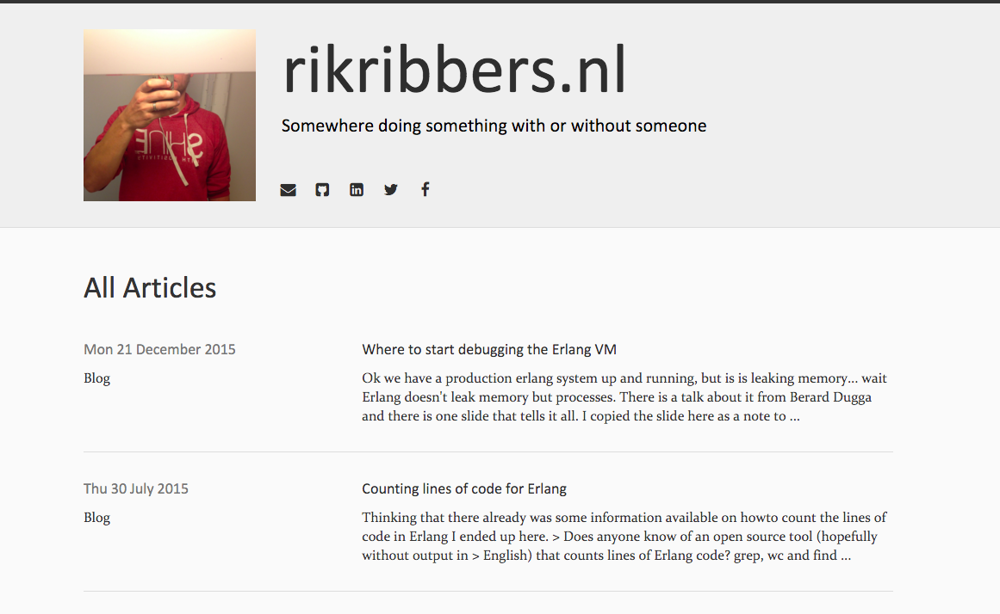

# pelican-somewhere

A theme for the [Pelican](http://getpelican.com) static site generator. A shameless ripoff of @nairobilug [alchemy](https://github.com/nairobilug/pelican-alchemy) theme, which in turn is a shameless ripoff of  @porterjamesj's [crowsfoot](http://github.com/porterjamesj/crowsfoot) theme.

## Screenshot

## Installation

`git clone git@github.com:rikribers/pelican-somewhere.git`

Then set the pelican config variable `THEME` to the `somewhere` folder inside the cloned path.

## Usage

Pelican [documentation](http://docs.getpelican.com/en/latest/)

### Theme Options

| Config                    | Type       | Description               |
| ------------------------- | ---------- | ------------------------- |
| EXTRA_FAVICON [^1]        | BOOL       | Extra favicons            |
| LICENSE_NAME              | TEXT       | License (footer)          |
| LICENSE_URL               | URL        | -                         |
| MENU_ITEMS                | DICT       | Menu items                |
| META_DESCRIPTION          | TEXT       | Meta description          |
| PAGES_ON_MENU             | BOOL       | Pages on the menu         |
| CATEGORIES_ON_MENU        | BOOL       | Category link in menu     |
| TAGS_ON_MENU              | BOOL       | Tag link in menu          |
| ARCHIVES_ON_MENU          | BOOL       | Archives link in menu     |
| PROFILE_IMAGE             | URL        | Profile image             |
| SHOW_ARTICLE_AUTHOR       | BOOL       | Show/hide author          |
| SITE_SUBTEXT              | TEXT       | Header subtitle           |

| Config                    | Type       | Description               |
| ------------------------- | ---------- | ------------------------- |
| EMAIL_ADDRESS             | EMAIL      | Email (mailto)            |
| FB_ADDRESS                | URL        | Facebook                  |
| GITHUB_ADDRESS            | URL        | Github                    |
| SO_ADDRESS                | URL        | Stack Overflow            |
| TWITTER_ADDRESS           | URL        | Twitter                   |
| LINKEDIN_ADDRESS          | URL        | Linkedin                   |

An RSS icon will also appear on the nav if `FEED_ATOM` or `FEED_RSS` is set.

| Config                    | Type       | Description               |
| ------------------------- | ---------- | ------------------------- |
| DISQUS_SITENAME           | TEXT       | Disqus sitename           |
| GOOGLE_ANALYTICS_DOMAIN   | TEXT       | Google analytics          |
| GOOGLE_ANALYTICS_ID       | TEXT       | Google analytics          |

## Live Demo

[rikribbers.nl](https://rikribbers.nl)

## License

MIT

[^1]: http://realfavicongenerator.net/faq#why_so_many_files "Why so many files?"
